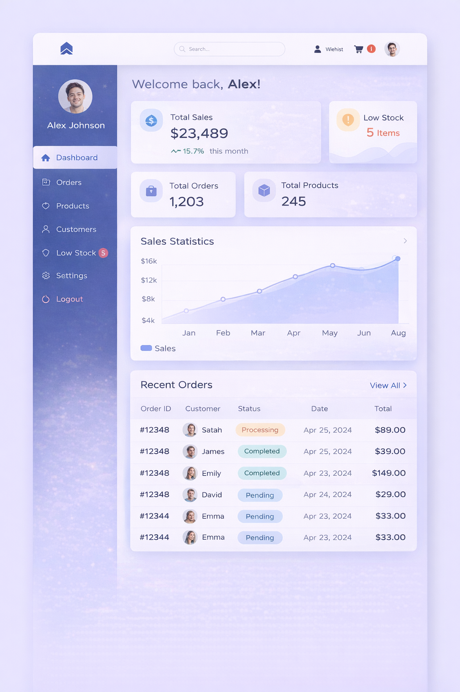
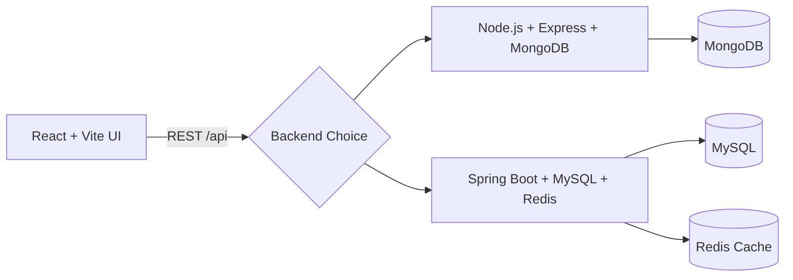

# Full Stack E-Commerce Platform

<p align="center">
  React + Vite frontend with dual backend implementations:
  <strong>Node.js/Express</strong> and <strong>Spring Boot</strong>.
</p>

<p align="center">
  
  
  
  
  
</p>

---

## Project Highlights

- Modern storefront + admin dashboard experience
- Shared business domain across two backend stacks
- JWT auth, cart, orders, reviews, payments, banners, and profile modules
- Frontend built with React Query + Tailwind CSS
- Spring backend includes Redis caching and data seeding

---

## UI Preview

| Home | Product Listing |
|---|---|
|  |  |

| Product Display | Checkout |
|---|---|
|  |  |

| Dashboard | Inventory |
|---|---|
|  |  |

| Manage Orders | Order Success |
|---|---|
|  |  |

---

## Architecture



---

## Monorepo Structure

```text
full_stack_web_app/
|- ui/               # React + Vite frontend
|- server/           # Node.js + Express API (MongoDB)
|- server-spring/    # Spring Boot API (MySQL + Redis)
|- designs/          # UI screenshots and design references
`- README.md
```

---

## Tech Stack

### Frontend (`ui`)
- React 19
- Vite 7
- TypeScript
- Tailwind CSS
- TanStack React Query

### Backend Option 1 (`server`)
- Node.js + Express
- MongoDB + Mongoose
- JWT auth
- Express Validator

### Backend Option 2 (`server-spring`)
- Java 17 + Spring Boot 3.3
- Spring Security + JWT
- Spring Data JPA (MySQL)
- Redis cache
- Lombok + MapStruct

---

## Quick Start

### 1. Clone and move into project

```bash
git clone <your-repo-url>
cd full_stack_web_app
```

### 2. Frontend setup

```bash
cd ui
npm install
```

Create `ui/.env`:

```env
VITE_API_BASE_URL=http://localhost:5000
```

Run frontend:

```bash
npm run dev
```

Frontend runs on `http://localhost:5173`.

---

## Run With Spring Backend (Recommended)

Prerequisites:
- Java 17+
- Maven 3.8+ (or Maven wrapper if you add one)
- MySQL 8+
- Redis 7+

Run:

```bash
cd server-spring
mvn clean package -DskipTests
java -jar target/ecommerce-backend-1.0.0.jar
```

Alternative:

```bash
mvn spring-boot:run
```

Spring API base URL: `http://localhost:5000/api`

Default seeded users:
- `admin@example.com` / `Password@123`
- `customer1@example.com` / `Password@123`
- `customer2@example.com` / `Password@123`

---

## Run With Node Backend

Prerequisites:
- Node.js 18+
- MongoDB running locally or cloud URI

Install and run:

```bash
cd server
npm install
```

Create `server/.env`:

```env
MONGO_URI=<your_mongodb_connection_string>
JWT_SECRET=<your_jwt_secret>
PORT=5000
CLIENT_ORIGIN=http://localhost:5173
```

Optional seed:

```bash
npm run seed
```

Start dev server:

```bash
npm run dev
```

Node API base URL: `http://localhost:5000/api`

---

## API Coverage (High Level)

- Auth: register, login, profile read/update
- Products: list, details by slug, CRUD (admin), stock updates
- Categories: listing and admin management
- Cart: add/update/remove/fetch
- Orders: create, user history, admin list, status updates
- Payments: create + verify flow
- Reviews: purchase-guarded review submission
- Home/Profile/Banners/Newsletter/Admin dashboard endpoints

---

## Development Notes

- Use only one backend at a time on port `5000`
- Keep secrets in local `.env` files only (never commit)
- `server-spring/target/` and `node_modules/` are ignored from Git

---

## Module Readmes

- [Spring backend guide](server-spring/README.md)
- [Node backend guide](server/README.md)
- [Frontend notes](ui/README.md)
